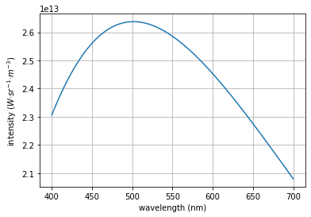

# coloured_spectra
> Got a spectra? Use this to find the observed colour!


Works great when applied to a single spectra. Using this for hyperspectral though... this Python implementation is too slow to be practical. (Can be magnitudes faster if coded in Julia)

Documentation site: [https://yiweimao.github.io/coloured_spectra/](https://yiweimao.github.io/coloured_spectra/)

Blog post: [https://yiweimao.github.io/blog/colour_of_spectra/](https://yiweimao.github.io/blog/colour_of_spectra/)

## Install

`pip install coloured-spectra`

## Examples

Find the observed colour of a blackbody at 6500 K.

```python
from coloured_spectra.coloured_spectra import *
import numpy as np
import pickle
import matplotlib.pyplot as plt
import cv2

```

    /Users/eway/.pyenv/versions/3.8.3/lib/python3.8/site-packages/pandas/compat/__init__.py:97: UserWarning: Could not import the lzma module. Your installed Python is incomplete. Attempting to use lzma compression will result in a RuntimeError.
      warnings.warn(msg)


```python
bb = Blackbody(5778)
bb.plot()
```





```python
def show_blackbody_colour(T_K):
    bb = Blackbody(T_K,np.linspace(380,750))
    
    sRGB = spectra2sRGB(bb.λ_nm,bb.B_λT)

    # Due to normalisation choices, the brightness can change depending on the spectra
    # show the colour at max brightness
    HSV = cv2.cvtColor(np.reshape(sRGB,(1,1,3)), cv2.COLOR_RGB2HSV_FULL)
    HSV[0,0,2] = 255
    RGB = cv2.cvtColor(HSV, cv2.COLOR_HSV2RGB_FULL)

    plot_colour(RGB)
```

This approximates the colour of the Sun with a blackbody temperature of 5778 K.

```python
show_blackbody_colour(5778)
```


```python
show_blackbody_colour(11000) # what about the star Rigel?
```


If you have a hyperspectral line, you can colour it in by the observed colour. For this, the invisible UV and NIR is painted white on top of a black background. This look up table spectrum is:

```python
plot_hsv_LUT_spectrum()
```


```python
lines_nm = [254,436,546,764,405,365,578,750,738,697,812,772,912,801,842,795,706,826,852,727] # approx sorted by emission strength
img = np.zeros((100,1000))
wavelengths = np.linspace(350,850,1000)

strength = 1.
for line in lines_nm: 
    indx = np.sum(wavelengths<line)
    if indx > 0 and indx < 1000:
        img[:,indx-2:indx+2] = strength
        strength -= 0.05

plt.imshow(img,cmap="gray",extent=[np.min(wavelengths),np.max(wavelengths),0,np.shape(img)[0]])
plt.xlabel("wavelength (nm)")
```


    Text(0.5, 0, 'wavelength (nm)')


You can see the emission lines have been coloured.

```python
colour_hyperspectral_line(wavelengths,img)
```

    100%|██████████| 100/100 [00:01<00:00, 57.32it/s]


You can also return a column of observed colour given a hyperspectral line. It's just very slow. 

```python
hyperspec_line2colour(wavelengths,img)
```

    100%|██████████| 100/100 [00:03<00:00, 31.57it/s]


You may want to colour in a band of a multispectral or hyperspectral datacube according to the central wavelength. 


